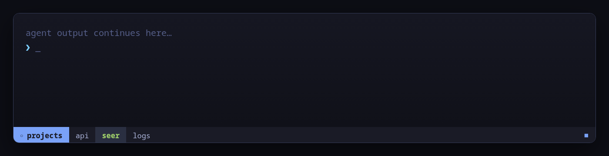

# Recife

A zero-runtime tmux theme inspired by Tokyo Night and named after Recife, Brazil.



Recife shows only what tmux uniquely owns: prefix mode, the current session, window names, and an optional [Seer](https://github.com/carlosarraes/tmux-seer) status square. It ships no Git, network, battery, music, clock, or background status scripts.

## Install with TPM

Add Recife before Seer and before TPM's final `run` line:

```tmux
set -g @plugin 'carlosarraes/tmux-recife'
set -g @plugin 'carlosarraes/tmux-seer' # optional

run '~/.tmux/plugins/tpm/tpm'
```

Press `prefix + I`, then reload tmux.

## Configure

All settings are optional and must appear before the plugin line:

```tmux
set -g @recife_accent '#7aa2f7'
set -g @recife_show_seer 'on'
set -g @recife_status_right '#{host_short}'
```

| Option | Default |
|---|---|
| `@recife_background` | `#1a1b26` |
| `@recife_surface` | `#2a2f41` |
| `@recife_foreground` | `#a9b1d6` |
| `@recife_accent` | `#7aa2f7` |
| `@recife_active` | `#9ece6a` |
| `@recife_alert` | `#e0af68` |
| `@recife_waiting` | `#565f89` |
| `@recife_status_right` | empty |
| `@recife_show_seer` | `on` |
| `@recife_seer_accents` | `on` |

`@recife_status_right` accepts static tmux formats but deliberately rejects `#()` commands. This keeps the status line at zero runtime processes.

With Seer installed, Recife summarizes the current session in its left marker and colors every window name from agents in that window: green while working, gray while waiting for input, and the normal Recife colors otherwise. Other sessions and machines do not affect these accents. Prefix mode stays yellow and takes priority over the session marker and active window. Set `@recife_seer_accents 'off'` for static colors; this is independent from `@recife_show_seer`.

## Develop

```sh
just check
```

Recife is available under the MIT license.
